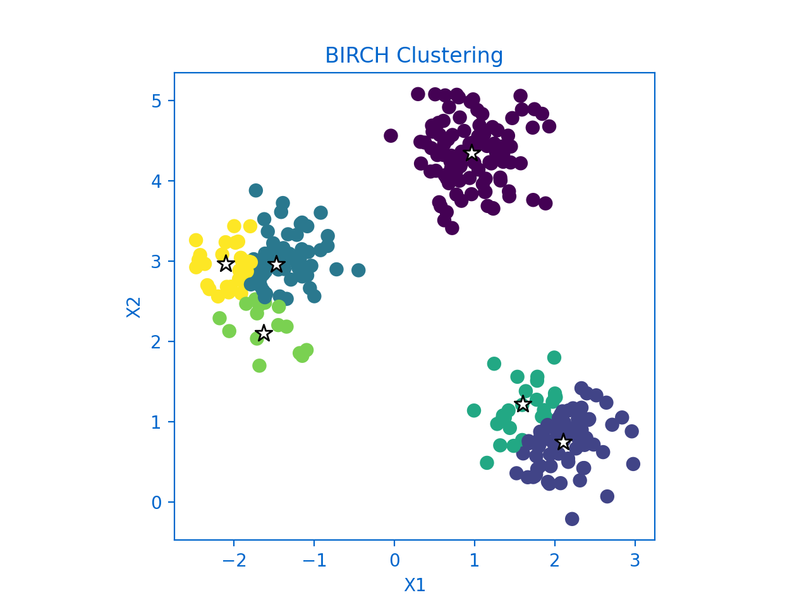
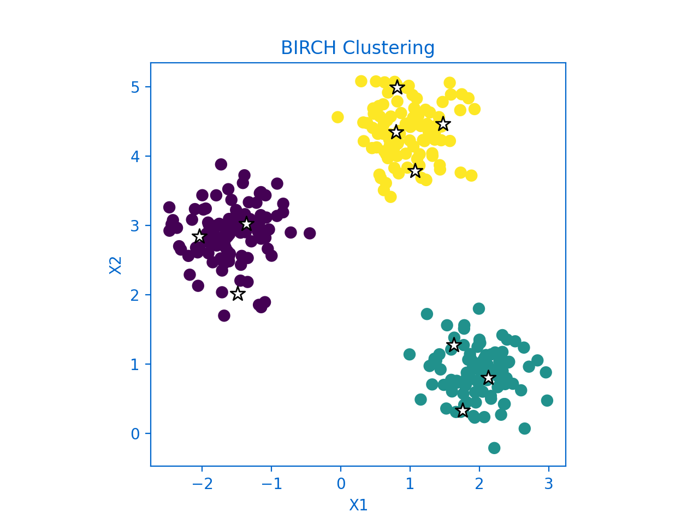

<!--Open Preview (Ctrl+Shift+V)-->
# Balanced Iterative Reducing And Clustering Using Hierarchies (BIRCH)

## Table of Contents
* [Description](#description-)
* [Dependencies](#dependencies-)

## Description :
* unsupervised data mining algorithm
* handle noise effectively
* makes full use of available memory to derive the finest possible sub-clusters

*Figure1 created using* `Plot_BIRCH`

*Figure2 created using* `Plot_BIRCH`

## Dependencies :
* [Numpy](http://www.numpy.org/)
* [Matplotlib](https://matplotlib.org/)
* [scikit-learn](https://scikit-learn.org/stable/)

