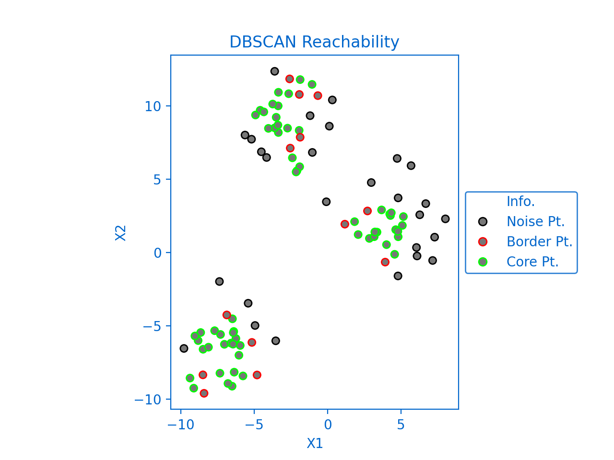
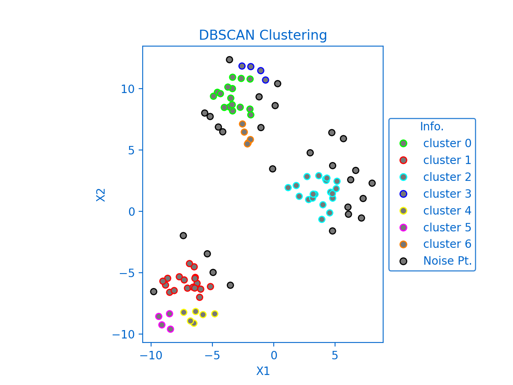

<!--Open Preview (Ctrl+Shift+V)-->
# Density-Based Spatial Clustering of Applications with Noise (DBSCAN)

## Table of Contents
* [Description](#description-)
* [Parameters](#parameters-)
* [Dependencies](#dependencies-)

## Description :
* assuming that clusters are dense regions in space separated by regions of lower density
* robust to outliers
* does not require the number of clusters to be told beforehand

## Parameters :
* ### Epsilon 
    is the radius of the circle to be created around each data point to check the density

* ### minPoints 
    is the minimum number of data points required inside that circle for that data point to be classified as a Core point.

## data points classifications:
* ### Core point
    if the number of points within epsilon radius is at least minPoints
* ### Border point
    If it's reachable from a core point and the number of points within epsilon radius is less than minPoints
* ### Noise/Outlier
    If it's not a core point and not reachable from any core points

*Figure1 created using* `Plot_Reachability`

*Figure2 created using* `Plot_Clusters`

## Dependencies :
* [Numpy](http://www.numpy.org/)
* [Matplotlib](https://matplotlib.org/)
* [scikit-learn](https://scikit-learn.org/stable/)

