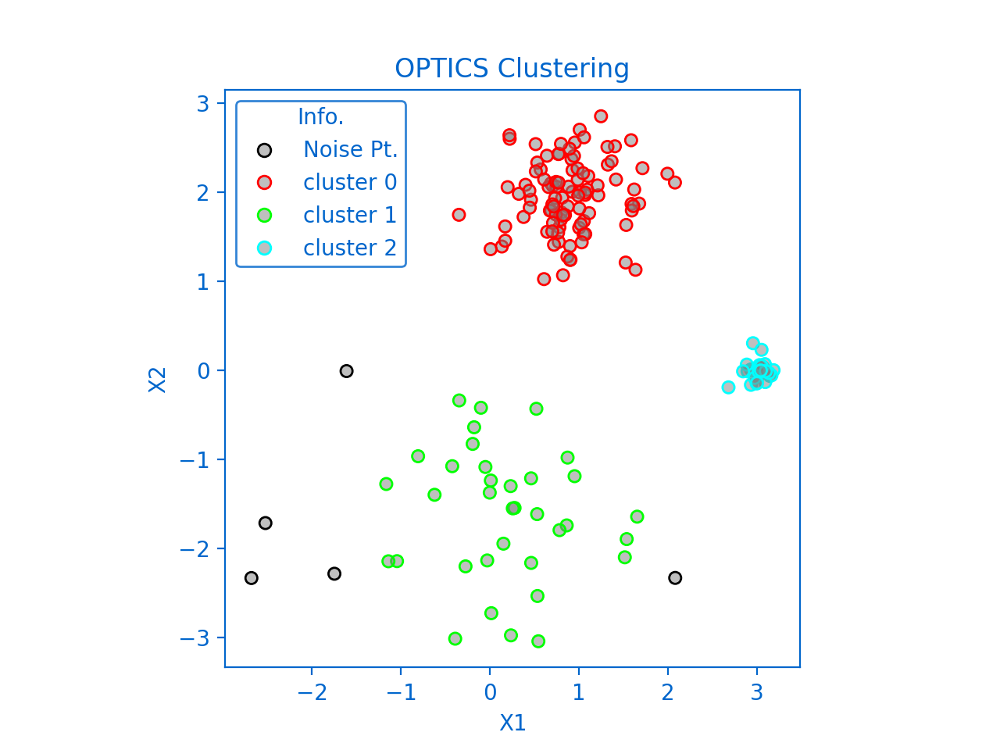
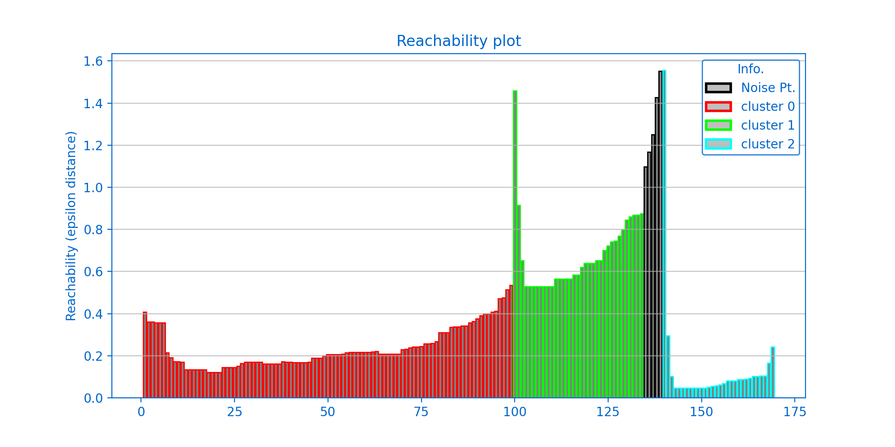

<!--Open Preview (Ctrl+Shift+V)-->
# Ordering Points To Identify The Clustering Structure (OPTICS)

## Table of Contents
* [Description](#description)
* [Parameters](#parameters)
* [Dependencies](#dependencies)

## Description :
* assuming that clusters are dense regions in space separated by regions of lower density
* robust to outliers
* does not require the number of clusters to be told beforehand

## Parameters :
* ### Epsilon 
    is the radius of the circle to be created around each data point to check the density

* ### minPoints 
    is the minimum number of data points required inside that circle for that data point to be classified as a Core point.

## Terms:
* ### Core point
    if the number of points within epsilon radius is at least minPoints
* ### Border point
    If it's reachable from a core point and the number of points within epsilon radius is less than minPoints
* ### Noise/Outlier
    If it's not a core point and not reachable from any core points
* ### Core distance
    If the point is no core point, it does not have a core distance.
    else, it’s the minPoint-th smallest distance to the neighborhood points.
    describes the minimum value for epsilon in order to keep the point a core point.
* ### Reachability distance
    If the point is no core point, it does not have a reachability distance.
    else, it's the bigger of the core distance or the distance to a reachable point,
    describes the distance which is reachable from a core point.

*Figure1 created using* `Plot_OPTICS`

*Figure2 created using* `Reachability_Plot`

* valleys imply that a short distance needs to be traveled from one point to the next, it represent distinct clusters in the point pattern

* More dense cluster have lower reachability distances and lower valleys on the plot

* Less dense clusters have higher reachability distances and higher valleys on the plot 

## Dependencies :
* [Numpy](http://www.numpy.org/)
* [Matplotlib](https://matplotlib.org/)
* [scikit-learn](https://scikit-learn.org/stable/)

