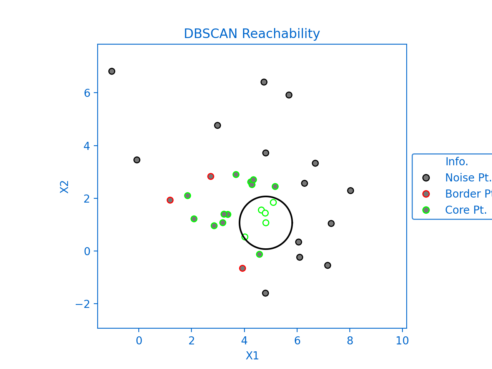
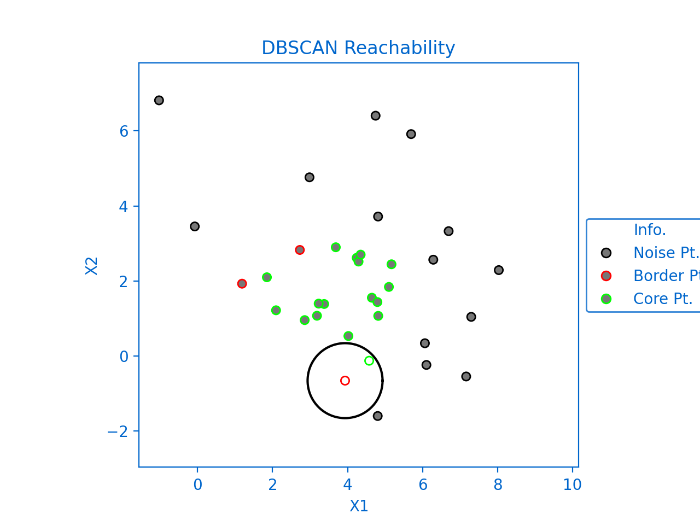

<!--Open Preview (Ctrl+Shift+V)-->
# Mean Shift Clustering:
>Mean shift clustering aims to discover “blobs” in a smooth density of samples.
It is a centroid-based algorithm, which works by updating candidates for centroids to be the mean of the points within a given region.
These candidates are then filtered in a post-processing stage to eliminate near-duplicates to form the final set of centroids.
Seeding is performed using a binning technique for scalability.
##### - scikit_learn


## Table of Contents
* [Description](#Description)
* [Dependencies](#Dependencies)
* [Implementation Phases](#Implementation-Phases)
* [Usage Example](#Usage-Example)
* [References](#References)

## Description :
reimplementation of scikit-learn cluster.MeanShift model in a simplified, more readable and plottable method

## Dependencies :
[Numpy](http://www.numpy.org/)

## Implementation Phases :

### Phase 1:
-------------------------------------------------------------------------------------

```python
def get_bandwidth(self,X,quantile = 0.3):
    n_neighbors = int(X.shape[0] * quantile)
    distance_matrix = np.linalg.norm(X - np.expand_dims(X, axis=1),axis =-1)
    return np.sum(np.sort(distance_matrix,axis = 1)[:,n_neighbors - 1])/distance_matrix.shape[0]
```

```python
def init_centers(self,X,bandwidth,min_bin_freq = 1):
    point,idx, freq = np.unique(np.round(X/bandwidth),axis=0,return_counts=True,return_index=True)
    idx = np.argsort(idx)
    bin_seeds = point[idx][freq >= min_bin_freq] * bandwidth
    return bin_seeds
```

*Figure1 renderd using* `Plot_Pre_Shifted_Centers`


### Phase 2:
-------------------------------------------------------------------------------------

```python
def shift_centers(self,X,centers,radius, max_iter):
    stop_thresh = 1e-3 * radius
    X_stack = np.repeat(np.expand_dims(X,axis=0),centers.shape[0],axis=0)
    completed_iterations = np.zeros(centers.shape[0])
    centers_history = np.expand_dims(centers.copy(),axis=0)
    for _ in range(max_iter):
        dist = np.linalg.norm(X - np.expand_dims(centers,axis=1),axis=-1)
        centers = np.nanmean(np.where(np.expand_dims(dist < radius,axis=-1),X_stack,np.nan),axis=1)
        diff = np.linalg.norm(centers - centers_history[-1],axis =-1)  > stop_thresh
        centers_history = np.vstack((centers_history,np.expand_dims(centers,axis=0)))
        completed_iterations += diff
        if np.all(~diff):
            break
    n_points_within = np.sum(dist < radius,axis=1)
    return centers,n_points_within,completed_iterations,centers_history
```
*Figure2 renderd using* `Plot_Shifting`


### Phase 3:
-------------------------------------------------------------------------------------

```python
def filter_centers(self,centers,bandwidth):
    dist = np.linalg.norm(centers - np.expand_dims(centers, axis=1),axis=-1) < bandwidth
    idx = np.ones(centers.shape[0],dtype=bool)
    ids = np.ones(centers.shape[0],dtype=int)
    for i in range(dist.shape[0]):
        if idx[i]:
            idx[dist[i]] = 0
            idx[i] = 1
            ids[dist[i]] = i
    return centers[idx],centers[ids]
```
*Figure3 renderd using* `Plot_Discarding`



### Phase 4:
-------------------------------------------------------------------------------------

```python
self.labels = np.argmin(np.linalg.norm(X - np.expand_dims(self.centers, axis=1),axis =-1),axis=0)
```
*Figure4 renderd using* `Plot_Clustering`



## Usage Example :
```python
from sklearn.datasets import make_blobs
from MS_model import *
from plot_assest import *

x,y = make_blobs(n_samples=1000, centers=3, cluster_std=1.8,random_state=38)

model = Mean_Shift()
model.fit(x)
Plot_Pre_Shifted_Centers(model,x,grid='sqr')
Plot_Shifting(model,x)
Plot_Discarding(model,x)
Plot_Clustering(model,x)
```


## References :
- **[scikit-learn](https://scikit-learn.org/stable/modules/generated/sklearn.cluster.MeanShift.html)**
- **[wikipedia](https://en.wikipedia.org/wiki/Mean_shift)**
